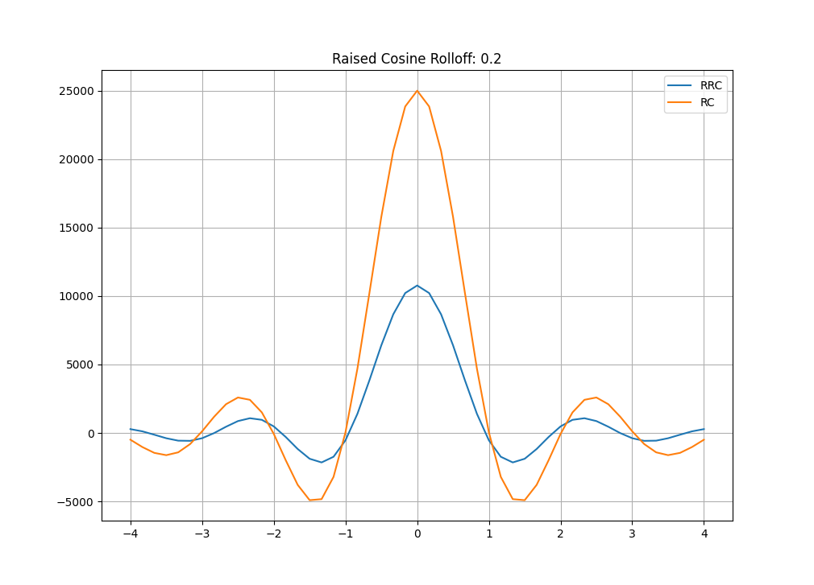

# rrc-gen
Generate finite impulse response taps for square root raised cosine filters, using design parameters passed on the command line. The program generates a plot of the Raised Cosine and Root Raised Cosine impulse response for the arguments passed, and generates a report file that contains a c-style array of filter taps.
## Requires
- Python3
- NumPY
- MatPlotLib
## Usage
````
python3 rrc-gen.py <rolloff rate> <span> <samples per symbol> <amplitude>
```` 
## Example
````
python3 rrc-gen.py 0.2 8 6 25000
````

## Contents of Report File
````
# Command line: rrc-gen.py 0.2 8 6 25000 

# RRC Pulse Filter


const __prog__ int16_t __attribute__((space(prog))) RRCFilter[49] = {  \
      279, 117, -130, -387, -564, -577, \
      -385, -12, 453, 867, 1075, 957, \
      476, -296, -1172, -1886, -2154, -1740, \
      -537, 1400, 3837, 6404, 8667, 10218, \
      10770, 10218, 8667, 6404, 3837, 1400, \
      -537, -1740, -2154, -1886, -1172, -296, \
      476, 957, 1075, 867, 453, -12, \
      -385, -577, -564, -387, -130, 117, \
      279 };
````
